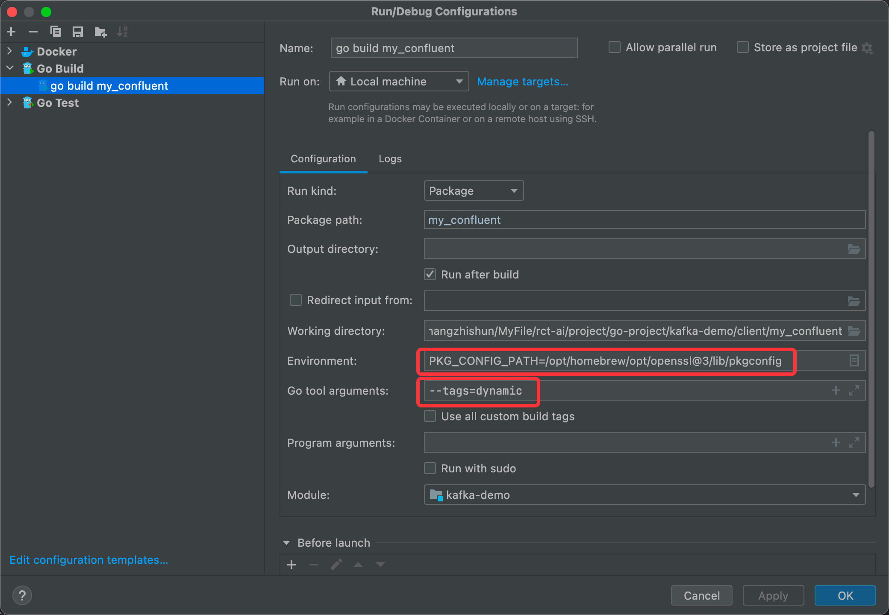

# 使用 confluent-kafka-go

## Mac环境

Go:1.17.2

1. 安装环境
```shell
brew install pkg-config
brew install librdkafka
brew install openssl
```
2. golang中配置运行环境
```shell
export PKG_CONFIG_PATH="/opt/homebrew/opt/openssl@3/lib/pkgconfig"
# 运行消费者为例
go build --tags dynamic consumer.go
```
3. Goland使用时需要添加参数


## Dockerfile
